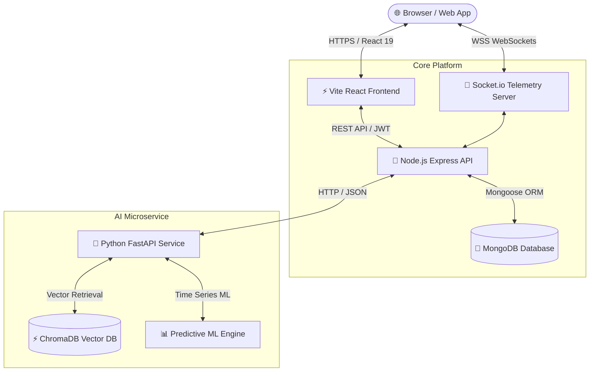

# ⚡ FleetFlow — Enterprise Fleet Management & Predictive AI Platform

[](https://react.dev)
[](https://fastapi.tiangolo.com)
[](https://nodejs.org)
[](https://mongodb.com)
[](https://trychroma.com)
[](https://socket.io)
[](https://docker.com)
[](https://github.com)

**FleetFlow** is a production-grade, full-stack fleet operations and AI-driven predictive maintenance platform designed for logistics fleets, vehicle rental operators, and commercial maintenance teams.

It bridges modern web applications with real-time IoT streaming, vector-embedded RAG AI intelligence, and machine learning failure forecasting into an intuitive command center.

---

## 📐 System Architecture



---

## 🌟 Key Engineering Highlights

### 1. 📡 Real-Time Live GPS Telemetry & Command Map (`/live-map`)
- **WebSocket Streaming**: Live Socket.io feed broadcasting vehicle GPS coordinates, speed, battery/fuel decay, and engine status every 2.5 seconds.
- **Interactive Leaflet Visualization**: Dynamic map rendering with custom pulsating status markers, vehicle route tracking, and geofencing alerts.
- **OBD-II Diagnostic Alerts**: Real-time Diagnostic Trouble Code (DTC) fault interception with 1-click roadside emergency dispatching.

### 2. 🧠 RAG AI Fleet Assistant & Diagnostic Knowledge Base
- **ChromaDB Vector Store**: Semantic indexing of PDF vehicle service manuals, SAE fault codes, and maintenance procedures.
- **Source Attribution & Citations**: Direct document & chunk relevance scoring for diagnostic queries.
- **Floating AI Drawer**: Accessible anywhere in the application with pre-engineered diagnostic prompt shortcuts.

### 3. 🔮 ML Predictive Maintenance & Inventory Forecasting
- **Health Index & RUL Estimation**: Time-series anomaly detection predicting Remaining Useful Life (RUL in days) and failure risk probability (Low/Medium/High/Critical).
- **Automated Inventory Buffer Math**: Calculates 30-day projected part consumption with automatic reorder triggers.

### 4. 🔒 Role-Based Access Control (RBAC) & Recruiter Demo Mode
- Multi-tier authorization supporting **Fleet Manager (Admin)**, **Senior Mechanic**, and **Fleet Driver/Customer** roles.
- **1-Click Recruiter Banner**: Top impersonation bar allowing instant testing of role permissions without typing credentials.

### 5. 🛠 Interactive REST API Documentation Hub (`/api-docs`)
- Built-in interactive API Explorer allowing recruiters to inspect request payloads, headers, schemas, and test live endpoints in 1 click.

---

## 🚀 Quick Start Guide

### Option 1: Docker Compose (Recommended)
Run the entire microservice stack (MongoDB + Express Backend + FastAPI AI Service + React Frontend) with a single command:

```bash
docker compose up --build
```
Access the application at `http://localhost`.

---

### Option 2: Local Development Setup

#### 1. Clone & Seed Database
```bash
git clone https://github.com/GVBharadwaj18/FleetFlow.git
cd FleetFlow/backend
npm install
npm run seed
```

#### 2. Start Backend Server
```bash
npm run dev
# Running on http://localhost:5000
```

#### 3. Start Frontend Web App
```bash
cd ../frontend
npm install
npm run dev
# Running on http://localhost:5173
```

#### 4. Start Python AI Microservice
```bash
cd ../ai-service
python -m venv .venv
source .venv/bin/activate  # On Windows: .venv\Scripts\activate
pip install -r requirements.txt
uvicorn main:app --reload --port 8000
# Running on http://localhost:8000
```

---

## 🔑 Demo Credentials

| Role | Email | Password | Access Highlights |
|---|---|---|---|
| **Fleet Manager (Admin)** | `admin@fleetflow.com` | `admin123` | Full administrative command center, inventory ordering, dispatch control |
| **Senior Mechanic** | `mechanic@fleetflow.com` | `mechanic123` | Assigned repair work orders, diagnostic DTC lookup, parts catalog |
| **Fleet Driver / User** | `driver@fleetflow.com` | `driver123` | Vehicle booking, emergency SOS requests, service history |

*(Tip: You can also use the **Demo Recruiter Bar** at the top of the frontend to switch roles instantly with 1 click!)*

---

## 🧪 Testing

```bash
# Frontend Unit Tests
cd frontend
npm test

# Backend Integration Tests
cd backend
npm test
```

---

## 💼 Resume Ready Highlights (Copy-Paste for CV / LinkedIn)

> **Full-Stack & AI Engineer | FleetFlow Platform**
> - **Architecture**: Architected a production-grade Fleet Management microservice platform using React 19, Node.js/Express, Python FastAPI, MongoDB, and Docker Compose.
> - **Real-Time Telemetry**: Implemented WebSocket real-time telemetry pipeline with Socket.io and Leaflet map rendering, broadcasting live vehicle coordinates and OBD-II fault codes.
> - **RAG & Vector AI**: Built RAG diagnostic search engine using Python FastAPI, ChromaDB vector store, and LangChain to query technical service manuals with semantic retrieval and source citations.
> - **Predictive ML**: Designed time-series predictive maintenance model calculating vehicle Health Index scores and Remaining Useful Life (RUL) to prevent engine failure.
> - **DevOps & Quality**: Configured multi-stage Docker containerization and automated GitHub Actions CI/CD workflows for automated unit and integration testing.

---

## 📄 License
Distributed under the MIT License. Built with ❤️ for enterprise engineering.
