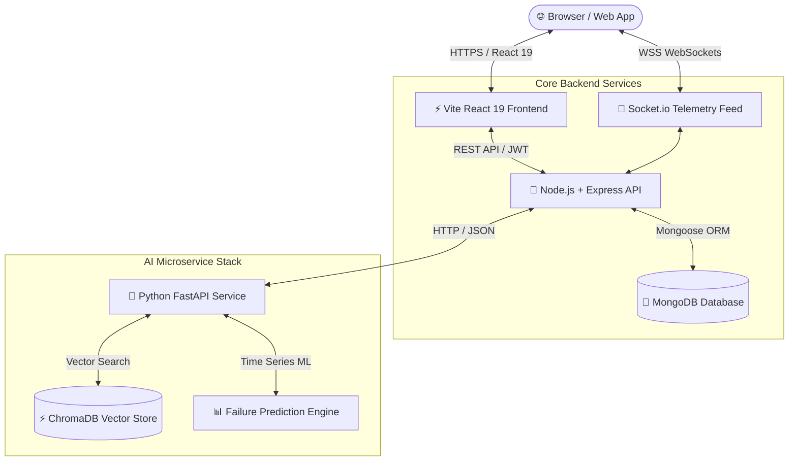

# ⚡ FleetFlow — Enterprise Vehicle Command Center & AI Fleet Operations Platform

[](https://react.dev)
[](https://fastapi.tiangolo.com)
[](https://nodejs.org)
[](https://mongodb.com)
[](https://trychroma.com)
[](https://socket.io)
[](https://docker.com)
[](LICENSE)

**FleetFlow** is an enterprise-grade, full-stack fleet command center and AI-driven predictive vehicle management platform. Designed for logistics operators, commercial fleet managers, garage chains, and emergency roadside dispatch teams, FleetFlow integrates real-time IoT GPS telemetry streaming, RAG vector AI search, failure forecasting, and multi-role operations into a single application.

---

## 📖 Table of Contents
1. [System Architecture](#-system-architecture)
2. [Role-Based Access Control (RBAC)](#-role-based-access-control-rbac)
3. [Core Feature Breakdown](#-core-feature-breakdown)
4. [Design System & Aesthetics](#-design-system--aesthetics)
5. [Demo Credentials & Quick Login](#-demo-credentials--quick-login)
6. [Setup & Running Instructions](#-setup--running-instructions)
7. [License](#-license)

---

## 📐 System Architecture

FleetFlow utilizes a decoupled microservices architecture designed for low-latency streaming and AI inference:



### Microservices Stack:
- **Frontend**: React 19, Vite, TailwindCSS (Custom Ocean Sapphire & Sunset Coral Theme), Lucide Icons, Recharts, Framer Motion, Leaflet Maps.
- **Backend API**: Node.js, Express.js, MongoDB (Mongoose ORM), JWT Authentication, Socket.io (Real-time telemetry).
- **AI Microservice**: Python 3.10+, FastAPI, ChromaDB (Vector database for RAG), LangChain, SentenceTransformers, Scikit-Learn.
- **Infrastructure**: Docker Compose multi-container orchestrations, GitHub Actions CI/CD workflows.

---

## 🔐 Role-Based Access Control (RBAC)

FleetFlow features a granular RBAC permissions system tailored for commercial fleet workflows:

### 👑 1. Fleet Manager (Admin)
- **Global Command Center**: Complete access to fleet health overview, operational metrics, revenue analytics, and interactive GPS map tracking.
- **Vehicle & Inventory Management**: Create, update, or remove fleet vehicles, vehicle categories, owner profiles, and spare parts inventory.
- **Financial Controls & Invoices**: Generate bills, review service costs, archive invoices, and track revenue trends.
- **Roadside Dispatch Oversight**: Assign mechanics to active emergency breakdown dispatches.

### 🔧 2. Senior Mechanic
- **Work Orders & Maintenance Logs**: Access assigned vehicle repair jobs, view diagnostic trouble code (DTC) faults, and record service histories.
- **Part Order Management**: Trigger low-stock spare part reorders with projected consumption math.
- **Roadside Assistance Dispatch**: Accept emergency dispatch requests, navigate to vehicle GPS coordinates, and resolve roadside issues.

### 🚚 3. Fleet Driver / Customer
- **Vehicle Booking & History**: Book fleet vehicles for delivery routes or rentals, and view complete booking logs.
- **Emergency Roadside SOS**: Submit 1-click GPS roadside breakdown requests (automatic latitude/longitude capture) with photo attachments.
- **Service Request Tracking**: Monitor the real-time status of assigned repair mechanics.

---

## 🌟 Core Feature Breakdown

### 📡 1. Live GPS Telemetry & Command Map (`/live-map`)
- **WebSocket Streaming**: Broadcasts live vehicle GPS positions, speed (km/h), fuel/battery decay, and engine diagnostic status every 2.5 seconds.
- **Bengaluru Regional Mapping**: Map viewports and live route tracking centered on Bengaluru, Karnataka (MG Road, Indiranagar, Whitefield, Koramangala, Electronic City, Hebbal).
- **OBD-II Fault Interception**: Automatically flags Diagnostic Trouble Codes (e.g., `P0300 Engine Misfire`, `P0171 System Too Lean`) with direct 1-click emergency dispatching.

### 🧠 2. RAG AI Diagnostic Assistant & Knowledge Base (`RAGChatWidget`)
- **ChromaDB Vector Retrieval**: Indexes vehicle service manuals, SAE fault code definitions, and manufacturer repair guidelines.
- **Semantic Citation Engine**: Returns precise answers with document source attribution and relevance scores.
- **Global AI Drawer**: Floating diagnostic assistant available on every page.

### 🔮 3. Predictive Maintenance & Inventory Forecasting (`/predictive-maintenance`)
- **Health Index & RUL Calculations**: Calculates vehicle Health Index (0-100 score) and Remaining Useful Life (RUL in days).
- **Inventory Buffer Math**: Predicts 30-day spare part consumption and alerts when stock drops below safety buffers.

### 🚨 4. Roadside Assistance Dispatch Queue (`/roadside-assistance`)
- **GPS Location Capture**: Captures driver latitude/longitude via browser HTML5 Geolocation API.
- **Mechanic Workflows**: Dispatches nearby mechanics and tracks job resolution lifecycle (`pending` → `assigned` → `in-progress` → `completed`).

### 📄 5. Invoicing & Financial Reports (`/invoices` & `/reports`)
- Printable invoice generation with itemized parts and labor breakdowns.
- Visual revenue, service cost, and maintenance frequency analytics via Recharts.

---

## 🎨 Design System & Aesthetics

FleetFlow features a modern **Travel-Tech Inspired Design System** crafted for maximum visual polish in both Light and Dark modes:

- **Primary Brand (`brand`)**: **Ocean Sapphire Blue** (`#2563eb` / `#1d4ed8`) — clean, vibrant, high-trust visual language.
- **Accent Highlight (`accent`)**: **Sunset Coral Amber** (`#f97316`) — warm, energetic highlights, risk pills, and notification badges.
- **Porcelain Light Mode**: Bright white cards (`bg-white/95`), ice-slate borders (`border-surface-200`), dark slate typography (`text-surface-900`), and clean blue navigation pills (`bg-brand-50 text-brand-600`). No hardcoded dark blocks.
- **Midnight Obsidian Dark Mode**: Deep slate background (`#0b1329`, `#0f172a`) with subtle glassmorphism and glowing neon accents.

---

## 🔑 Demo Credentials & Quick Login

You can log in using any of the seeded credentials below, or click the **Instant Demo Login** buttons on the sign-in page:

| Role | Email | Password | Allowed Capabilities |
|---|---|---|---|
| ⚡ **Fleet Manager (Admin)** | `admin@fleetflow.com` | `admin123` | Full administrative control, fleet management, billing, global dispatches |
| 🔧 **Senior Mechanic** | `mechanic@fleetflow.com` | `mechanic123` | Assigned work orders, DTC diagnostic lookup, parts ordering |
| 🚚 **Fleet Driver / User** | `driver@fleetflow.com` | `driver123` | Vehicle booking, emergency SOS breakdown requests, service status |

*(Tip: You can also use the **Demo Recruiter Bar** at the top of the header to switch RBAC roles instantaneously in 1 click!)*

---

## 🚀 Setup & Running Instructions

For detailed installation prerequisites, step-by-step execution guide, environment variables setup, and post-installation workflows, please see the separate setup documentation:

👉 **[Read Full Setup & Execution Guide (SETUP.md)](SETUP.md)**

### Quick Command Overview:
```bash
# 1. Clone repo
git clone https://github.com/GVBharadwaj18/FleetFlow.git
cd FleetFlow

# 2. Run with Docker Compose
docker compose up --build

# 3. Access web app
# Open http://localhost:5173 or http://localhost in browser
```

---

## 📜 License

This project is licensed under the **MIT License**.

```text
MIT License

Copyright (c) 2026 FleetFlow Engineering Team

Permission is hereby granted, free of charge, to any person obtaining a copy
of this software and associated documentation files (the "Software"), to deal
in the Software without restriction, including without limitation the rights
to use, copy, modify, merge, publish, distribute, sublicense, and/or sell
copies of the Software, and to permit persons to whom the Software is
furnished to do so, subject to the following conditions:

The above copyright notice and this permission notice shall be included in all
copies or substantial portions of the Software.

THE SOFTWARE IS PROVIDED "AS IS", WITHOUT WARRANTY OF ANY KIND, EXPRESS OR
IMPLIED, INCLUDING BUT NOT LIMITED TO THE WARRANTIES OF MERCHANTABILITY,
FITNESS FOR A PARTICULAR PURPOSE AND NONINFRINGEMENT. IN NO EVENT SHALL THE
AUTHORS OR COPYRIGHT HOLDERS BE LIABLE FOR ANY CLAIM, DAMAGES OR OTHER
LIABILITY, WHETHER IN AN ACTION OF CONTRACT, TORT OR OTHERWISE, ARISING FROM,
OUT OF OR IN CONNECTION WITH THE SOFTWARE OR THE USE OR OTHER DEALINGS IN THE
SOFTWARE.
```

Built with ❤️ for enterprise engineering and modern fleet operations.
