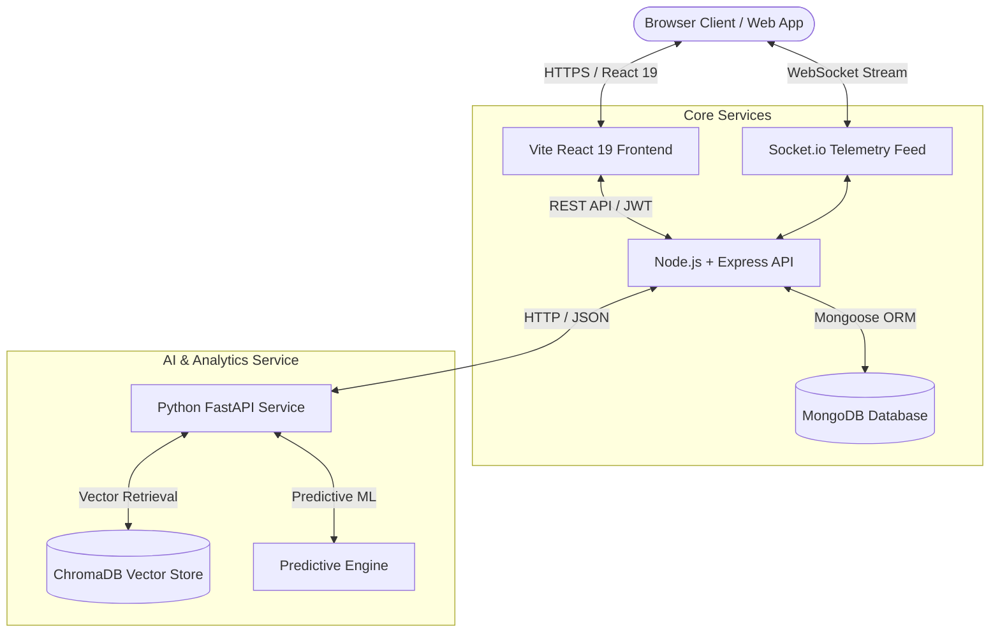

# FleetFlow — Enterprise Vehicle Command Center & AI Fleet Operations Platform

[](https://react.dev)
[](https://nodejs.org)
[](https://fastapi.tiangolo.com)
[](https://mongodb.com)
[](https://trychroma.com)
[](https://docker.com)
[](LICENSE)

**FleetFlow** is an enterprise-grade fleet management, real-time telemetry, and AI-driven predictive maintenance platform built for logistics companies, commercial fleet operators, garage networks, and emergency dispatch services.

The platform combines low-latency WebSocket IoT position tracking, Retrieval-Augmented Generation (RAG) diagnostic assistance, time-series failure forecasting, and role-based operational workflows into a unified command center.

---

## Table of Contents
1. [Architecture & Microservices](#architecture--microservices)
2. [Role-Based Access Control](#role-based-access-control)
3. [Key Operational Capabilities](#key-operational-capabilities)
4. [Design System & Interface](#design-system--interface)
5. [Demo Access Credentials](#demo-access-credentials)
6. [Installation & Setup](#installation--setup)
7. [License](#license)

---

## Architecture & Microservices

FleetFlow is engineered around a modular, event-driven microservices architecture:



### Component Stack
- **Frontend Layer**: React 19, Vite, TailwindCSS (Ocean Sapphire & Sunset Coral Palette), Recharts, Framer Motion, Leaflet Maps.
- **Backend API**: Node.js, Express.js, MongoDB (Mongoose ORM), JWT Authentication, Socket.io.
- **AI & Analytics**: Python 3.10+, FastAPI, ChromaDB Vector Store, LangChain, SentenceTransformers, Scikit-Learn.
- **DevOps**: Multi-stage Docker containerization, GitHub Actions CI/CD workflows.

---

## Role-Based Access Control

FleetFlow enforces strict Role-Based Access Control (RBAC) across three operational profiles:

### 1. Fleet Manager (Admin)
- **Executive Command Center**: Access to overall fleet metrics, revenue analytics, operational performance, and real-time fleet map monitoring.
- **Asset & Inventory Control**: Manage vehicles, categories, customer accounts, and spare parts inventory thresholds.
- **Financial Auditing**: View invoices, track service expenses, and generate billing reports.
- **Dispatch Oversight**: Assign mechanics to active roadside emergency requests.

### 2. Senior Mechanic
- **Work Orders & Repair Logs**: Inspect vehicle diagnostic trouble code (DTC) faults, update service histories, and log maintenance activities.
- **Inventory Requests**: Order replacement spare parts based on projected consumption rates.
- **Roadside Response**: Receive assigned breakdown dispatches, navigate to GPS coordinates, and resolve vehicle issues.

### 3. Fleet Driver / Customer
- **Route & Vehicle Bookings**: Schedule fleet vehicle reservations and view past route logs.
- **Emergency Roadside SOS**: Request instant breakdown assistance with automatic GPS location capture and photo uploads.
- **Status Monitoring**: Track assigned mechanics in real time during emergency responses.

---

## Key Operational Capabilities

### 1. Real-Time Telemetry & Command Map
- **Live WebSocket Tracking**: Broadcasts vehicle GPS position, speed (km/h), fuel/battery status, and OBD-II diagnostics every 2.5 seconds.
- **Bengaluru Fleet Coverage**: Default mapping and routing centered on Bengaluru, Karnataka (MG Road, Indiranagar, Whitefield, Koramangala, Electronic City, Hebbal).
- **Fault Detection & Dispatch**: Intercepts Diagnostic Trouble Codes (e.g., `P0300 Engine Misfire`, `P0171 System Too Lean`) and enables immediate mechanic dispatch.

### 2. Diagnostic Assistant (RAG Engine)
- **Vector Knowledge Base**: Indexes vehicle technical manuals, SAE fault standards, and repair procedures using ChromaDB.
- **Source Attribution**: Delivers diagnostic guidance complete with document citations and relevance confidence scores.
- **Global Assistant Panel**: Slide-over AI assistant available across all workspace pages.

### 3. Predictive Maintenance & Inventory Forecasting
- **Health Scoring**: Computes real-time vehicle Health Index scores (0-100) and Remaining Useful Life (RUL in days).
- **Stock Buffer Calculations**: Forecasts 30-day component consumption to prevent out-of-stock delays.

### 4. Roadside Emergency Queue
- **GPS Coordinates Capture**: Retrieves precision coordinates via HTML5 Geolocation.
- **Dispatch Lifecycle Management**: Tracks requests through `pending`, `assigned`, `in-progress`, and `completed` states.

---

## Design System & Interface

FleetFlow features a refined, travel-tech inspired design system built for clarity and responsiveness:

- **Primary Brand**: Ocean Sapphire Blue (`#2563eb` / `#1d4ed8`)
- **Secondary Accent**: Sunset Coral Amber (`#f97316`)
- **Light Theme**: Porcelain white card surfaces (`bg-white/95`), slate borders (`border-surface-200`), and dark slate typography.
- **Dark Theme**: Midnight slate surfaces (`#0b1329`, `#0f172a`) with subtle glassmorphic accents.

---

## Demo Access Credentials

The platform includes pre-seeded demo accounts for instant evaluation:

| Role | Email | Password | Access Scope |
|---|---|---|---|
| **Fleet Manager (Admin)** | `admin@fleetflow.com` | `admin123` | Full administrative control, asset management, billing, global dispatches |
| **Senior Mechanic** | `mechanic@fleetflow.com` | `mechanic123` | Assigned work orders, DTC diagnostic lookup, parts catalog |
| **Fleet Driver / User** | `driver@fleetflow.com` | `driver123` | Vehicle booking, emergency SOS breakdown requests, status tracking |

*(Note: The **Demo Recruiter Bar** at the top of the header allows 1-click role switching during testing.)*

---

## Installation & Setup

For step-by-step installation, environment variables, local seeding, and Docker containerization, refer to the setup guide:

👉 **[SETUP.md](SETUP.md)**

```bash
# Clone the repository
git clone https://github.com/GVBharadwaj18/FleetFlow.git
cd FleetFlow

# Launch via Docker Compose
docker compose up --build
```

---

## License

This project is licensed under the **MIT License**.
